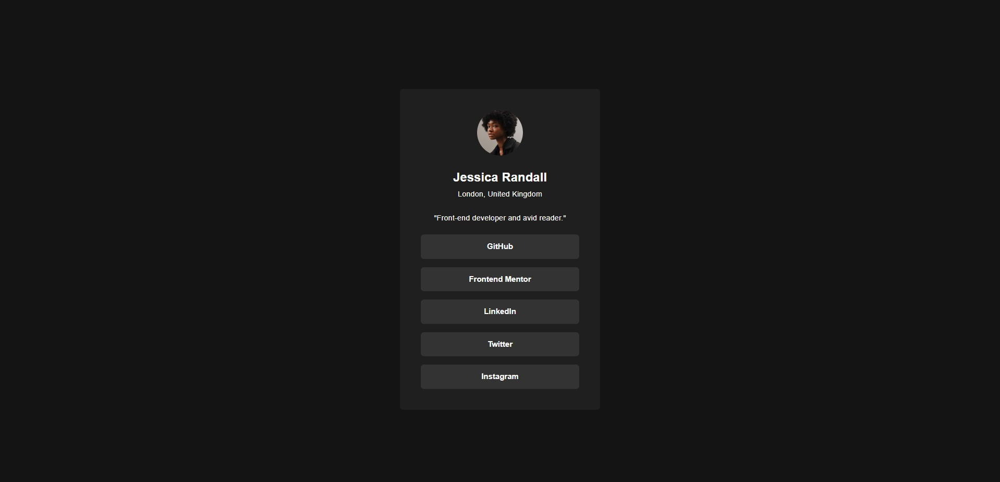
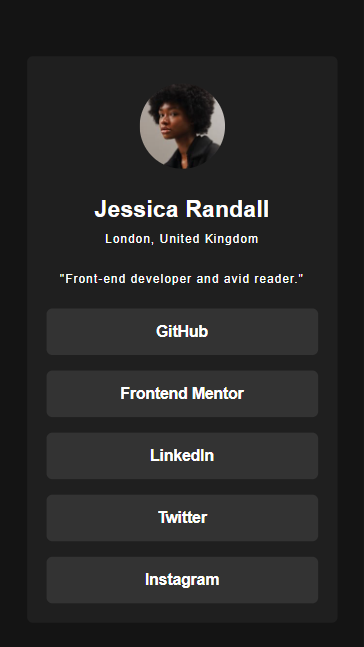

# Frontend Mentor - Social Links Profile Solution

This is my solution to the [Social Links Profile challenge on Frontend Mentor](https://www.frontendmentor.io/challenges/social-links-profile-UG32l9m6dQ). Frontend Mentor challenges are a great way to improve coding skills by building realistic projects.

## Overview

### The Challenge

Users should be able to:

- See hover and focus states for all interactive elements on the page

### Built With

- HTML5
- CSS3 (utilized Tailwind CSS framework)

### Screenshots

### Demo

You can preview the project [here](https://your-live-site-url.com).

### Links

- Solution URL: [Add solution URL here](https://your-solution-url.com)
- Live Site URL: [Add live site URL here](https://your-live-site-url.com)

## My Process

### What I Learned

- Utilized Tailwind CSS for efficient styling
- Implemented hover and focus states for interactive elements
- Gained experience in rapid prototyping

### Continued Development

In future projects, I aim to focus on:

- Exploring more advanced Tailwind CSS features
- Enhancing accessibility features
- Experimenting with animations and transitions

### Author

- GitHub - [Your Name](https://github.com/your-username)

## Acknowledgments

I'd like to thank Frontend Mentor for providing this challenge and Tailwind CSS for simplifying the styling process.
